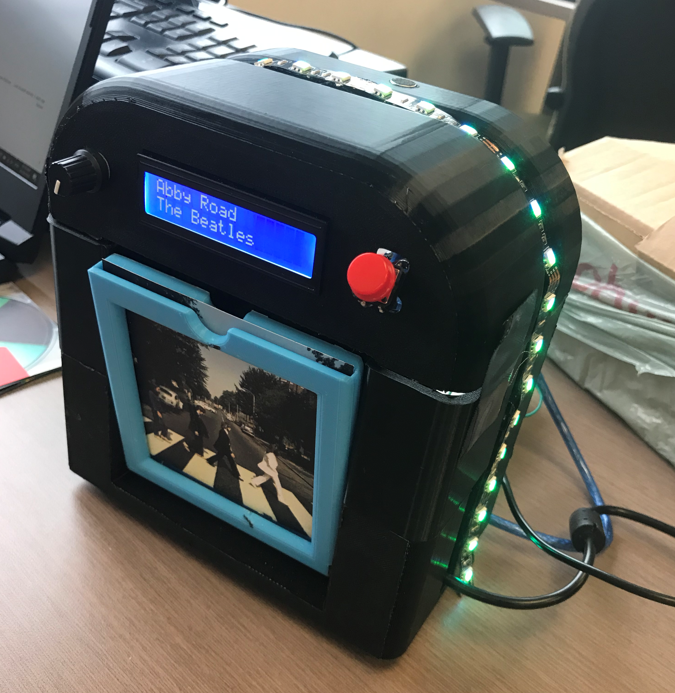

# iJukebox  
SYSC 3010 A   
Group L3-G6: Corbin Garlough, Yunas Magsi, Flynn Graham  
TA: Roger Selzler  

___

## Project Summary  
The iJukebox is a miniature Jukebox that sits in a common area, its main function is to read NFC cards and play songs while displaying the cover art of the song being played. These NFC cards are decorated with the artist’s album cover and store values for songs from a specific artist. When a user picks a song they like, they will insert their card in the iJukebox and it will scan the NFC card to place a request for that song to play from Spotify. The iJukebox reads NFC cards, fetches a corresponding song’s info from a Firebase database based on an ID read from the NFC tag, updates a display with the song info, and plays the song on a separate speaker. 

## Repo Description
Our project repo is made up of directories for the Python, Arduino, and web app code that is required to make the iJukebox work. We also have a directory for our WIPURs, and an image of the final iJukebox product. In the PythonWork directory you will find folders for the end to end, and unit tests for the system, the support files needed for the PN 532 NFC reader, the local database that we use to store play requests (iJukeboxDB), and the main program to run on the jukebox Pi (jukeboxMain.py). (FINISH SUMMARY OF ARDUINO FOLDER). (FINISH SUMMARY OF WEB APP FOLDER).

## Installation Instructions

## How to run the system
### Jukebox Pi
To get the jukebox Pi part of the system operational, open the jukeboxMain.py to make a few edits based on your specific information. First, on line 30 enter your email account you would like notifications to be sent to (right now the notifications only work with Gmail accounts). Next on line 307, change the IP address used in the post request to that of the Speaker Pi you are using. Now you can run this program, and once the other components are started, the iKukebox Pi is ready to rock out!

### Speaker Pi

### Arduinos

## How do you know the system is working properly?
To ensure the sytem is working correctly, you can run the tests found in the end to end communication, and unit test directories and observe their output. If all tests pass then when the main program for the system is run, inserting a card into the display slot and closing the door will start the song playing on the Speaker Pi, the song info will be displayed on the LCD screen, a request log will be seen in both the Firebase and local databases, and you will recieve an email notification with info about what song was played.
